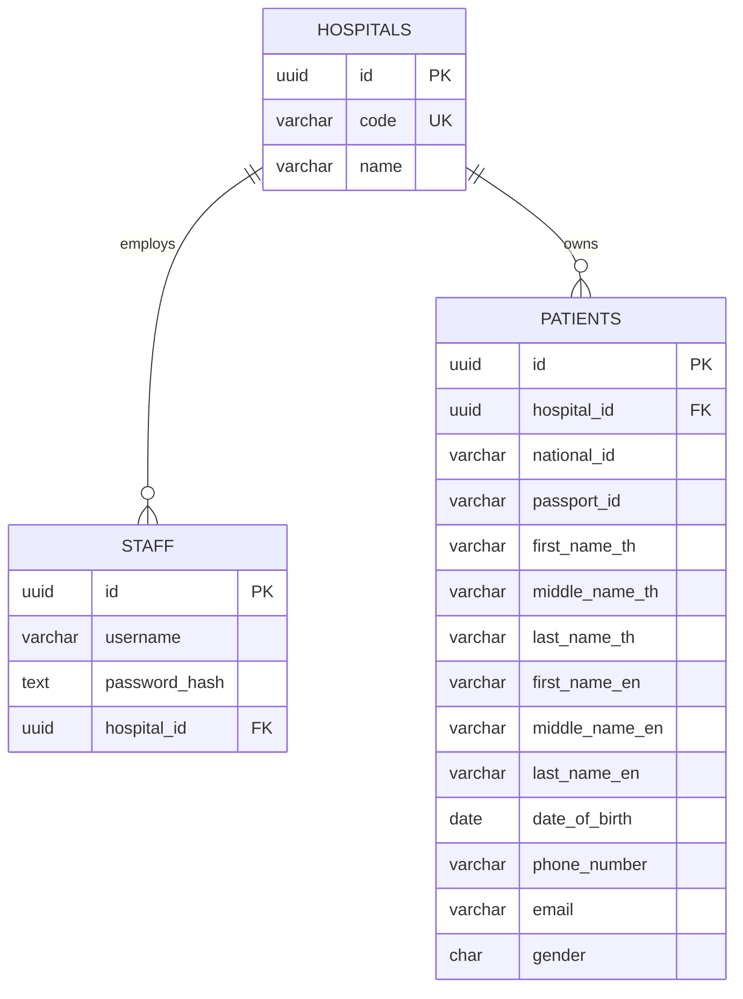

# ER diagram

`patients` requires either `national_id` or `passport_id`. Both identifiers are unique only inside a hospital, supporting separate HIS domains while staff authorization always limits access to the associated hospital.
